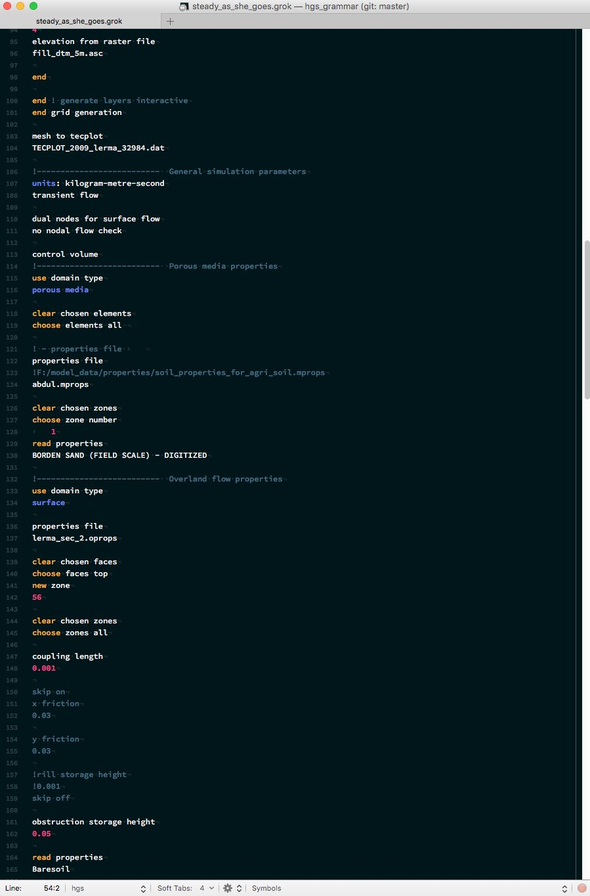
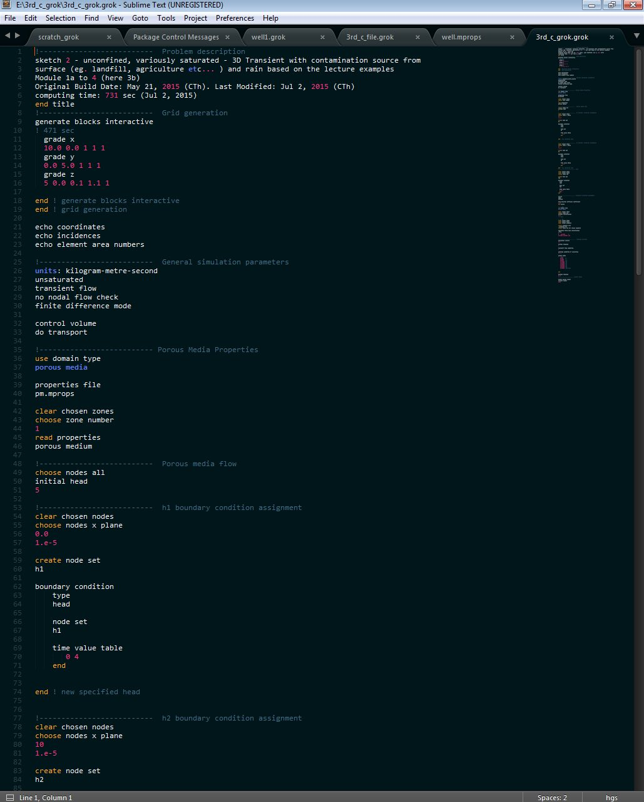

# HydroGeoSphere Language Grammar

This repository contains the necessary files for codehighlighting of [HydroGeoSphere][hgs] input files ("grok files"): The definition of the syntax of such input files, and the definition of which syntax to show in what coloring options. 

There are various options for text editors that understand this setup, it is tested using [TextMate][TM] on OSX and [SublimeText][ST] (versions for various flavours of operating systems exist). Other text editors that understand `tmLanguage` syntax specifications exist.

<figure>
    
    <figcaption>Screenshot of TextMate with hgs syntax highlighted.</figcaption>
</figure>

<figure>
    
    <figcaption>Screenshot of SublimeText with hgs syntax highlighted.</figcaption>
</figure>

This repository contains "compiled" version of the necessary files that need to be put into proper folders (see Section "Installation"). This repository contains also the [syntax definition as ASCII file][syntax_def_ascii].

Please contact me with questions related to the syntax or suggestions for improvements.

## Installation

### TextMate

The installation for TextMate is straight forward:

1. download the [hgs.tmbundle][hgs.tmbundle]
2. double click and follow the instructions

### SublimeText 
Two files need to be copied at two different locations. The destinations vary, depending on which version of SublimeText you use.

#### Directories

_OSX_:

- version 2: go to `/Applications/Sublime\ Text.app/Contents/MacOS/Packages`
- version 3: go to `Sublime Text` - `Preferences` - `Browse Packages`

_WINDOWS_:

- `$HomeDir\AppData\Roaming\Sublime Text 3\Installed Packages`

#### 1. Syntax Definition

- copy the [syntax definition file][ST_syntax] to one of the above mentioned directories
- restart SublimeText
- you should be able to set `hgs` as the language (view - syntax) of an open (grok) file

#### 2. Color Scheme

- copy the [SublimeText color scheme][ST_color_scheme] to one of the two paths described above
- go to `Sublime Text` - `Preferences` - `Settings - User`; a file will pop up where you can specity the color scheme you want to use, in this case refer to the one you just copied by its file name. Typically, this could look like this:

    // Settings in here override those in "Default/Preferences.sublime-settings",
    // and are overridden in turn by file type specific settings.
    {
    	"color_scheme": "Packages/Color Scheme - hgs/hgs.tmTheme"
    }

NOTE: the file ending of the package is not demanded here (no `sublime-package`)!

## Color Schemes
Color schemes can be viewed, modified, and created using [this][online_themes] online theme editor

## Notes

- [ ] investigate why the preamble does not show up as comment block in SublimeText

[hgs]: http://www.aquanty.com/hydrogeosphere/
[TM]: http://macromates.com/
[ST]: http://www.sublimetext.com
[online_themes]: http://tmtheme-editor.herokuapp.com
[ST3_zip]:http://stackoverflow.com/questions/20385550/syntax-highlight-tmlanguage-in-sublime-text-3-for-packages/29566977#29566977
[syntax_def_ascii]: ./packages/tm_hgs_language.grammar
[hgs.tmbundle]: ./packages/hgs.tmbundle
[ST_color_scheme]: ./packages/Color%20Scheme%20-%20hgs.sublime-package
[ST_syntax]: ./packages/hgs.sublime-package